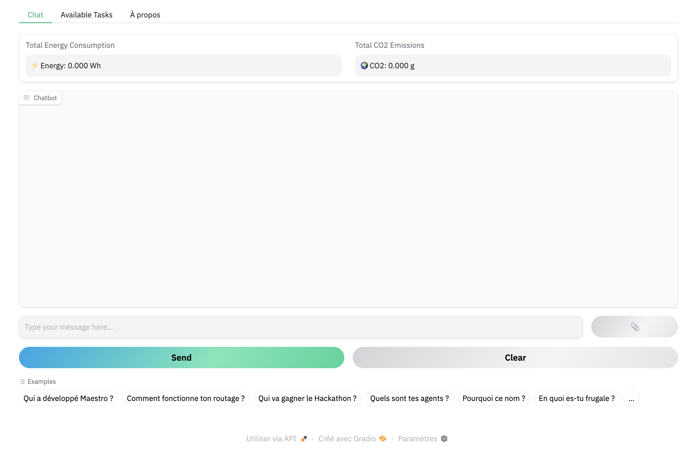

# Maestro - Frugal'IA 2025 Hackathon

Membres de l’équipe : Andrei, Caroline, Damien, Gabriel, Lionel, Romain, Sophie.

Durée du hackathon : du 15 au 16 novembre 2025.

## Slide-deck

[Slide-deck](assets/MAESTRO.pdf)

## Interface preview



## Installation

Run the Gradio app:

```bash
uv run gradio app/main.py
```

## Presentation

Maestro - Orchestrateur est un projet dont l'objectif est de proposer une interface de type orchestrateur ou routeur permettant à un utilisateur de répondre à son besoin avec la solution la plus adaptée et la plus optimisée

Sources:

- [.gitignore](.gitignore): [Python.gitignore](https://github.com/github/gitignore/blob/main/Python.gitignore)
- [uv](https://docs.astral.sh/uv/) setup: [uv-fastapi-example](https://github.com/astral-sh/uv-fastapi-example)

## Developer environment setup

```bash
set -a; source .env; set +a
```

Create virtual environment:

```bash
uv sync
```

Available commands:

```bash
task --list
```

See [Taskfile.yml](Taskfile.yml)
